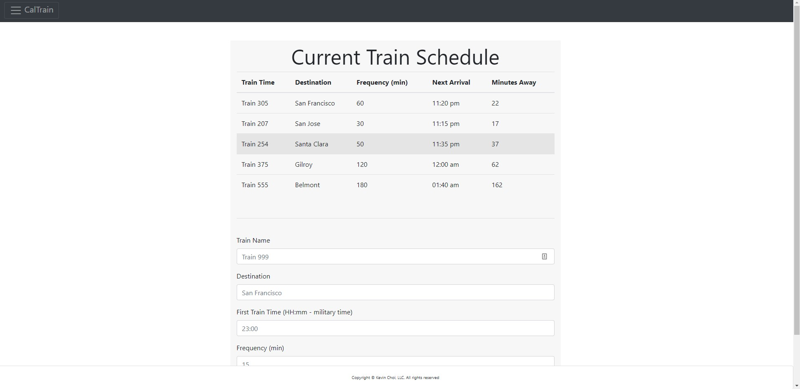
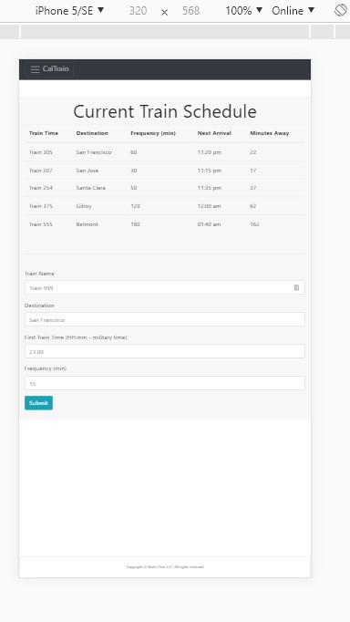

# TrainScheduler

## Main Pointers:
* Google Firebase for cloud database
* Moment JS for TIME
* Jquery
* Bootstrap
* Utilizing meta charset="utf-8" with train emoji photos!!!

###### Because data is being stored on a cloud databse, Google Firebase, users can see history that is being pulled from the cloud database. Users can continue to add more train routes but only administrators access to the Firebase can edit or delete changes. 

### Check out the app!

## Desktop Browser

## Mobile Browser

## Firebase Database
